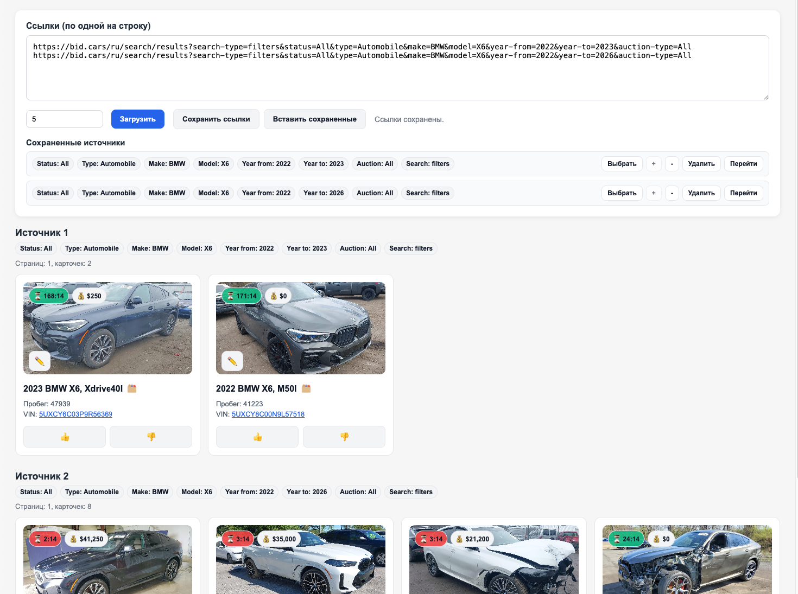

# BidCars monitor

Локальное веб-приложение для быстрой проверки лотов с BidCars по нескольким URL сразу.

## Что умеет

- Загружает данные по нескольким ссылкам поиска BidCars.
- Поддерживает пагинацию и объединяет результаты в карточки автомобилей.
- Позволяет отмечать карточки (`👍` / `👎`) и сохранять комментарии.
- Сохраняет голоса, комментарии и источники в `localStorage`.
- Формирует удобные бейджи с фильтрами и показывает ключевые метаданные (время до окончания, ставка, VIN и т.д.).

## Какие ссылки использовать

Копируйте ссылки из раздела поиска BidCars в формате:

- `https://bid.cars/ru/search/results?...[параметры_фильтра]`

Именно такие URL корректно преобразуются приложением в API-запросы для загрузки лотов.

## Как запустить

1. Поднимите локальный PHP-сервер в папке проекта:

   ```bash
   php -S localhost:8000
   ```

2. Откройте в браузере:

   [http://localhost:8000](http://localhost:8000)

## Если есть ошибки запросов

Если BidCars не отвечает или запросы завершаются ошибкой, используйте прокси с европейским IP для доменов `bid.cars` и `bid.car`, затем повторите загрузку.